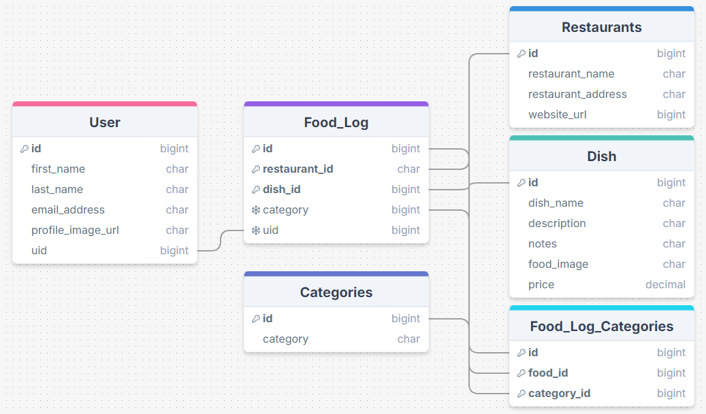
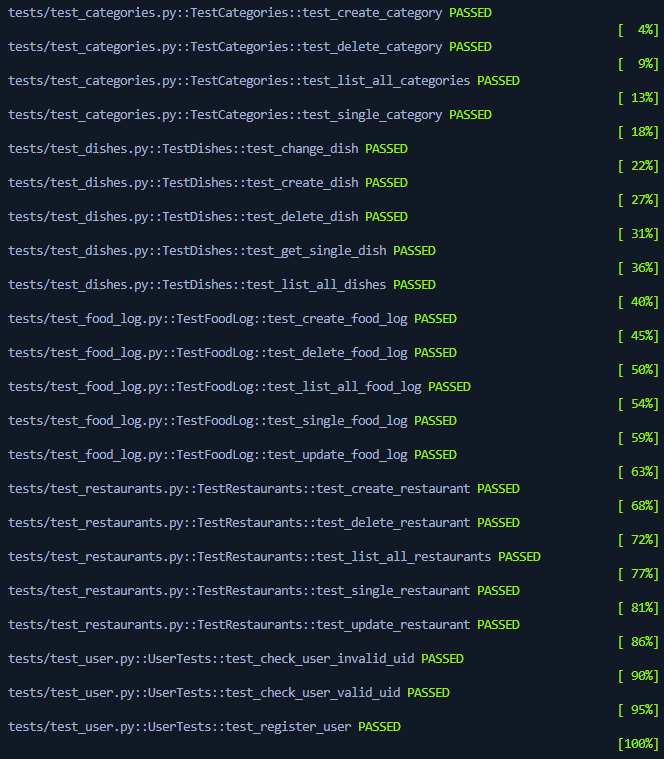

# CULINARY EXPLORER
## PROJECT OVERVIEW
- Dining out can become a complex and often stressful experience for people with dietary restrictions, such as allergies or intolerances. That is where Culinary Explorer steps in, it creates a single spot where you can log the different restaurants you've eaten at and your experience.

# FEATURES
- Landing page for non authorized users to get to know a bit about Culinary Explorer without having to sing up for an account. 
- Google auth through Firebase Auth.
- Allows users to create, edit, and delete their notes on restaurants compliance with dietary restrictions based on who's logged in. 

# PROJECT SETUP INSTRUCTIONS FOR FIRST TIME INSTALLATION
Follow these steps to set up and run the project:

1. Install the required packages using Pipenv:
    ```sh
    pipenv install
    ```

2. Activate the virtual environment:
    ```sh
    pipenv shell
    ```

3. Create the database migrations:
    ```sh
    python manage.py makemigrations
    ```

4. Apply the migrations to the database:
    ```sh
    python manage.py migrate
    ```

5. Start the development server:
    ```sh
    python manage.py runserver
    ```


## HOW TO START THE SERVER FOR FRONT-END
1. Open Terminal:
    ```sh
    pipenv shell
    ```

2. Start Python Interpreter:
    ```sh
    CTRL + Shift + P and click Python: Select Interpreter
    ```    

3. Select the correct Python Interpreter:
    ```sh
    Python (version)(`file_name_server_randomString`:Pipenv) ~.\virtualenvs\sec...
    ```

4. Open Terminal to Start Server:
    ```sh
    python manage.py runserver
    ```       

5. Verify server is running by clicking to open web page to see data:
    ```sh
    Starting development server at http://127.0.0.1:8000/
    ```
   


## TO LOAD FIXTURES 
1. Create the database migrations:
    ```sh
    python manage.py makemigrations
    ```

2. Apply the migrations to the database:
    ```sh
    python manage.py migrate
    ```

3. Load each fixtures into the database:
    ```sh
    python manage.py loaddata fixture_file_name.json
    ```

4. Verify the fixtures were loaded correctly:
    ``` sh
    CTRL + SHIFT + P to open SQllite: 
    Database and verify the data is in the explorer 
    click file_name_item_name
    click play to the right of item name
    ```
# ENV SET UP

- NEXT_PUBLIC_FIREBASE_API_KEY=""
- NEXT_PUBLIC_FIREBASE_AUTH_DOMAIN=""
- <span style="color:gray">Add your Server URL to the NEXT_PUBLIC_DATABASE_URL variable below (ex: http://localhost:8000)</span>
- NEXT_PUBLIC_DATABASE_URL="http://localhost:8000"
    

# TECH / FRAMEWORK USED
-  
- [API Documentation](https://documenter.getpostman.com/view/29856352/2sAXjKbYPn)
- [Project Board](https://github.com/users/jgramirez0210/projects/10/views/1?layout=table)

### BUILT WITH  
- React
- Django
- SQL
- Firebase

# TESTS
- User: CR
- Food_Log: CRUD
- Restaurant: CRUD
- Dish: CRUD
- Category: CRUD
- Food_log_Category: CRD

1. Open terminal and run tests:
    ```sh
    python manage.py test
    ```
-      

# TESTING API'S IN POSTMAN
[](https://app.getpostman.com/run-collection/29856352-163c6545-7056-4f07-849c-8ffef5b5891d?action=collection%2Ffork&source=rip_markdown&collection-url=entityId%3D29856352-163c6545-7056-4f07-849c-8ffef5b5891d%26entityType%3Dcollection%26workspaceId%3De6b25edf-b010-4ed0-8f1e-fc0ea9066ca2)

# CREDITS

- [Jesse Ramirez](https://github.com/jgramirez0210) 
