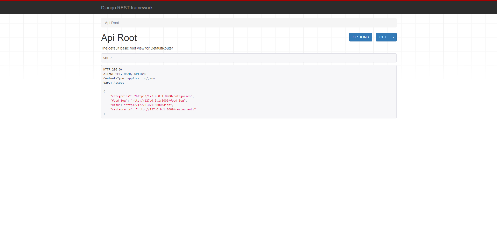

# LEVEL UP: YOUR ULTIMATE GAMING PLATFORM
Level Up is the premier destination for gamers looking to unleash their creativity and connect with like-minded enthusiasts. Our platform empowers you to create new games, organize events, and join a vibrant community of gamers from around the world.

# FEATURES
- Game Creation and Management: Gamers can create games, specifying the game type from a predefined list. They can update or delete their games, reflecting the one-to-many relationship between Gamer and Game.

- Event Creation and Management: Gamers can organize events for games, indicating their role as the organizer. This feature leverages the one-to-many relationship between Gamer (as organizers) and Event.

- Event Participation: Gamers can sign up for events, showcasing the many-to-many relationship between Gamer and Event through the EventGamer join table. This feature would include the ability to join or leave an event.


# PROJECT SETUP INSTRUCTIONS FOR FIRST TIME INSTALLATION
Follow these steps to set up and run the project:

1. Install the required packages using Pipenv:
    ```sh
    pipenv install
    ```

2. Activate the virtual environment:
    ```sh
    pipenv shell
    ```

3. Create the database migrations:
    ```sh
    python manage.py makemigrations
    ```

4. Apply the migrations to the database:
    ```sh
    python manage.py migrate
    ```

5. Start the development server:
    ```sh
    python manage.py runserver
    ```


## HOW TO START THE SERVER FOR FRONT-END
1. Open Terminal:
    ```sh
    pipenv shell
    ```

2. Start Python Interpreter:
    ```sh
    CTRL + Shift + P and click Python: Select Interpreter
    ```    

3. Select the correct Python Interpreter:
    ```sh
    Python (version)(`file_name_server_randomString`:Pipenv) ~.\virtualenvs\sec...
    ```

4. Open Terminal to Start Server:
    ```sh
    python manage.py runserver
    ```       

5. Verify server is running by clicking to open web page to see data:
    ```sh
    Starting development server at http://127.0.0.1:8000/
    ```
   


## TO LOAD FIXTURES 
1. Create the database migrations:
    ```sh
    python manage.py makemigrations
    ```

2. Apply the migrations to the database:
    ```sh
    python manage.py migrate
    ```

3. Load each fixtures into the database:
    ```sh
    python manage.py loaddata fixture_file_name.json
    ```

4. Verify the fixtures were loaded correctly:
    ``` sh
    CTRL + SHIFT + P to open SQllite: 
    Database and verify the data is in the explorer 
    click file_name_item_name
    click play to the right of item name
    ```


# TECH / FRAMEWORK USED
-  
- [API Documentation](https://documenter.getpostman.com/view/29856352/2sA3kSo3i8)

### BUILT WITH  
- React
- Django
- SQL
- Firebase

# TESTS
- Tests CRUD on Events, Gamer, & Game
- Tests get single and get all on Game Type 

1. Open terminal and run tests:
    ```sh
    python manage.py test
    ```

# TESTING API'S IN POSTMAN
[](https://app.getpostman.com/run-collection/29856352-fe239767-c915-4ee4-816a-98391d697b67?action=collection%2Ffork&source=rip_markdown&collection-url=entityId%3D29856352-fe239767-c915-4ee4-816a-98391d697b67%26entityType%3Dcollection%26workspaceId%3D05f2e31e-03ef-427f-b169-137d2a156107)

# CREDITS

- Jesse Ramirez 
